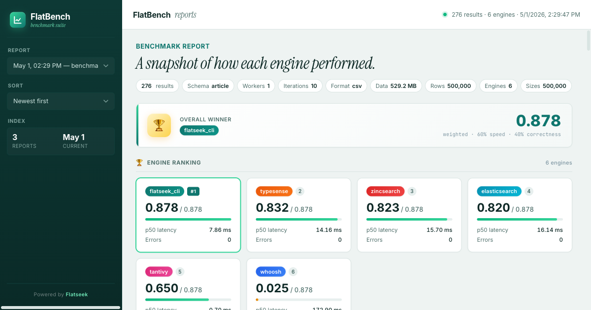

<div align="center">


# Flatbench

**Search engine benchmark suite — compare Flatseek against Elasticsearch, tantivy, Typesense, Whoosh, ZincSearch, SQLite, and DuckDB.**

[](https://pypi.org/project/flatbench/)
[](https://github.com/flatseek/flatbench/actions)
[](https://github.com/flatseek/flatbench/blob/main/LICENSE)

Benchmarks: build speed, search latency, wildcard, range queries, and aggregations. Results saved as JSON + Markdown to `./output/`.

</div>

---
<p align="center">
  
</p>

## Install

```bash
pip install flatbench
```

Requires Python ≥ 3.10, Docker (for full engine comparison).

---

## Quick Start

### 1. Start all search engines (Docker)

```bash
flatbench make up
```

Starts: Flatseek API (port 8000), Elasticsearch (9200), Typesense (8108), ZincSearch (4080).

### 2. Generate a dataset

```bash
flatbench generate -s article -r 500000 -o ./data/article.csv
```

### 3. Run benchmark comparison

```bash
flatbench compare -e flatseek_cli,elasticsearch,tantivy,typesense,whoosh,zincsearch -s 500000
```

Results → `output/benchmark_YYYYMMDD_HHMMSS.json` + `.md`.

---

## CLI Reference

### Commands

| Command | Description |
|---------|-------------|
| `flatbench generate` | Generate synthetic dataset |
| `flatbench compare` | Compare multiple engines |
| `flatbench run` | Benchmark single engine |
| `flatbench serve` | Serve report viewer locally |
| `flatbench make` | Run infrastructure Makefile targets |

### Generate

```bash
flatbench generate --schema <schema> --rows <N> --output <path> [--format csv|jsonl]
```

Schemas: `standard`, `ecommerce`, `logs`, `nested`, `sparse`, `article`, `adsb`, `campaign`, `devops`, `sosmed`, `blockchain`

### Compare

```bash
flatbench compare --engines <engines> --sizes <sizes> [options]
```

**Options:**

| Flag | Description | Default |
|------|-------------|---------|
| `--schema` | Data schema | `standard` |
| `--workers`, `-w` | Parallel index workers | `1` |
| `--format` | `csv` or `jsonl` | `csv` |
| `--source`, `-S` | Use existing CSV/JSONL instead of generating | — |
| `--mode`, `-m` | `normal` (disk) or `tmpfs` (RAM) | `normal` |
| `--cache-dir`, `-c` | Cache generated data for reuse | — |
| `--skip-build` | Skip build (use existing index) | — |
| `--serve` | After compare completes, build site and serve report | — |

**Engines:** `flatseek`, `flatseek_cli`, `elasticsearch`, `tantivy`, `typesense`, `whoosh`, `zincsearch`, `sqlite`, `duckdb`

**Sizes:** multiple sizes supported, e.g. `--sizes 1000 10000 500000`

### Run

```bash
flatbench run --engine <engine> --data <path> --index-dir <path> [-o output] [--iterations N]
```

### Serve

```bash
flatbench serve [--dir ./output] [--port 8080]
```

Opens the report viewer in your browser automatically.

### Make (Infrastructure)

```bash
flatbench make <targets...>     # Run Makefile targets (default: help)
flatbench make up               # Start all services (docker-compose up -d)
flatbench make down             # Stop services (keep volumes)
flatbench make clean             # Stop and remove volumes
flatbench make status            # Show service status
flatbench make logs              # View logs (follow mode)
flatbench make benchmark NROWS=500000   # Run benchmark via Make
```

**Service management:**

| Target | Description |
|--------|-------------|
| `up/down/clean/status/logs` | Docker compose lifecycle |
| `fs-health/fs-stats/fs-create/fs-delete` | Flatseek API (port 8000) |
| `es-health/es-stats/es-create/es-delete` | Elasticsearch (port 9200) |
| `ts-health/ts-stats/ts-create/ts-delete` | Typesense (port 8108) |
| `zs-health/zs-stats/zs-create/zs-delete` | ZincSearch (port 4080) |

### Examples

```bash
# Generate article dataset (500K rows)
flatbench generate -s article -r 500000 -o ./data/article.csv

# Compare at single scale
flatbench compare -e flatseek_cli,elasticsearch -s 500000

# Compare at multiple scales
flatbench compare -e flatseek,tantivy -s 1000 10000 500000

# Use existing CSV (reuse generated data)
flatbench compare -e flatseek,elasticsearch -s 500000 -S ./data/article.csv

# RAM-backed index (tmpfs mode, faster builds)
flatbench compare -e flatseek,tantivy -s 500000 -m tmpfs

# Compare and auto-serve report
flatbench compare -e flatseek,tantivy -s 500000 --serve

# Run benchmark via Make
flatbench make benchmark NROWS=500000 ENGINES="flatseek_cli,elasticsearch,tantivy"
```

**Service URLs:**

| Service | URL |
|---------|-----|
| Flatseek API | http://localhost:8000 |
| Elasticsearch | http://localhost:9200 |
| Typesense | http://localhost:8108 |
| ZincSearch | http://localhost:4080 |
| Kibana | http://localhost:5601 (dev profile) |

---

## Available Schemas

| Schema | Fields | Description |
|--------|--------|-------------|
| `article` | 8 | Blog articles: id, title, content, tags, views, published_at, author |
| `standard` | 12 | Generic: id, name, email, phone, city, country, status, balance, created_at, updated_at, is_verified, tags |
| `ecommerce` | 12 | Order tracking data |
| `logs` | 11 | Log entries: timestamp, level, service, message, etc. |
| `nested` | 6 | Complex nested JSON objects |
| `sosmed` | 9 | Social media posts |
| `devops` | 11 | Infrastructure/monitoring data |
| `adsb` | 10 | Flight tracking data |
| `campaign` | 10 | Marketing campaign data |
| `blockchain` | 9 | Blockchain transaction data |

---

## Benchmark Operations

| Operation | Description | Metrics |
|-----------|-------------|---------|
| `build_index` | Bulk API indexing (1000 rows/batch) | duration_ms, rows/sec, index_size_mb |
| `search` | Full-text query | p50_ms, p95_ms, p99_ms, ops/sec |
| `wildcard_search` | Prefix/suffix wildcard queries | p50_ms, p95_ms, ops/sec |
| `range_query` | Numeric/date range filtering | duration_ms, hits, ops/sec |
| `aggregate` | Terms/stats aggregations | duration_ms, bucket_count, ops/sec |

---

## Output

Results written to `./output/` with timestamps:

```
output/
├── benchmark_20260501_142947.json   # Full structured results
├── benchmark_20260501_142947.md     # Markdown summary
└── index.json                        # Report manifest (for web viewer)
```

### Report Viewer

**Live:** [bench.flatseek.io](https://bench.flatseek.io) — hosted Flatbench report viewer.

**Local:** Run `flatbench serve --port 8080` or open `report_viewer.html` directly in browser.

---

## Build Static Site

Build output directory as a static site (for self-hosted or Vercel deploy):

```bash
make build
# or
bash build.sh
```

Output → `public/` directory with `index.html`, `output/*.json`, `output/*.md`.

### Deploy to Vercel

```bash
make deploy        # Deploy to production (flatbench.vercel.app)
make deploy-preview  # Deploy preview build
```

---

## Project Structure

```
flatbench/
├── Dockerfile              # Flatseek API server container
├── docker-compose.yml       # All engine containers
├── Makefile                 # Infrastructure + build commands
├── build.sh                 # Static site build script
├── report_viewer.html       # Web UI for browsing results
├── pyproject.toml           # flatbench package definition
├── src/flatbench/
│   ├── cli.py               # CLI entry point
│   ├── benchmarks/           # Benchmark orchestration + report generation
│   ├── generators/           # Synthetic data generators (schema-aware)
│   ├── runners/              # Engine runners (HTTP API / CLI)
│   │   ├── flatseek_api.py   # Flatseek HTTP API runner
│   │   ├── flatseek_cli.py   # Flatseek CLI runner
│   │   ├── elasticsearch.py   # Elasticsearch runner
│   │   ├── tantivy.py        # tantivy (Rust) runner
│   │   ├── typesense.py      # Typesense runner
│   │   ├── whoosh.py         # Whoosh runner
│   │   ├── zincsearch.py     # ZincSearch runner
│   │   ├── sqlite.py         # SQLite FTS5 runner
│   │   └── duckdb.py         # DuckDB full-text runner
│   └── output/               # Benchmark results (JSON + Markdown)
```

---

## Adding a New Engine

```python
from flatbench.runners import BaseRunner, BenchmarkResult, register_engine

@register_engine("myengine")
class MyEngineRunner(BaseRunner):
    name = "myengine"
    supports_aggregate = False
    supports_range_query = True
    supports_wildcard = True

    def build_index(self, data_path: str, **kwargs) -> BenchmarkResult:
        # Bulk API indexing logic
        pass

    def search(self, query: str, iterations: int = 10, **kwargs) -> BenchmarkResult:
        # Search via HTTP API
        pass
```

Then add to `--engines` list: `--engines flatseek,myengine,...`

---

## Benchmark Results (Latest: 500K rows, article schema)

> **Latest Full results:** [`bench.flatseek.io`](https://bench.flatseek.io)

### Overall Score (60% speed · 40% correctness)

| Engine | Speed | Correctness | Score |
|--------|-------|-------------|-------|
| **Flatseek** | 🟢 | 🟢 | **0.878** ◀ |
| typesense | 🟢 | 🟢 | 0.832 |
| zincsearch | 🟢 | 🟢 | 0.823 |
| elasticsearch | 🟢 | 🟢 | 0.820 |
| tantivy | 🟢 | 🔴 | 0.650 |
| whoosh | 🔴 | 🔴 | 0.025 |

### Key Takeaways

- **Correctness matters:** Flatseek is the only engine with zero correctness errors. Tantivy misses 99.4% of range query hits.
- **Search:** Tantivy fastest (0.7ms p50), but wrong. Flatseek second-fastest correct (7.9ms).
- **Build:** Tantivy wins (21s for 500K), but Flatseek build is reasonable (217s).
- **Aggregation:** Competitors (ES, tantivy) are 20–300× faster — Flatseek aggregation is a known weakness.
